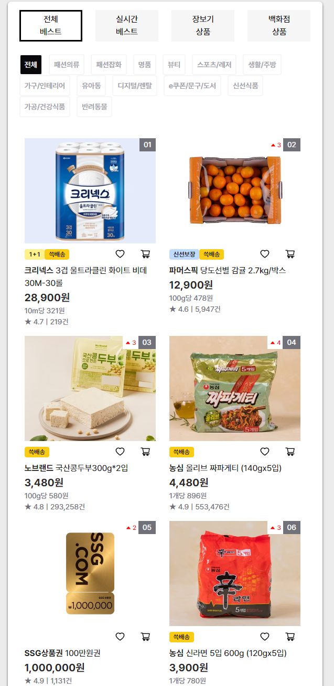

## 구동 방법

### 1. 의존성 설치 및 개발 환경 실행

```bash
yarn install
yarn dev
```

- api 서버는 SSG 측에서 제공한 별도의 mock_api로 동작하며 localhost:3000으로 실행합니다. (프로젝트 내 미포함)

### 2. 브라우저로 접속

- 접속 시 자동으로 /allBest로 redirect됩니다.
- 서버가 미구동 상태인 경우 에러 화면이 출력됩니다.

## 주요 기능



### 1. 탭 선택

- 전체 베스트 / 실시간 베스트 / 장보기 상품 / 백화점 상품 4개의 탭을 각각 클릭하여 이동합니다.
- 각각의 페이지가 route됩니다.
- allBest / realTime / grocery / department

### 2. 카테고리 선택

- 탭 아래에 상품 카테고리가 CSR로 출력됩니다.
- mock_api에 카테고리별 데이터가 존재하지 않아 전체 카테고리만 출력됩니다.
- 그 외 카테고리는 "상품 정보가 없습니다." 문구가 출력됩니다.
- 실시간 베스트 페이지에서는 카테고리가 출력되지 않습니다.

### 3. 상품 조회

- 각 탭에 해당하는 api로 조회한 데이터가 화면에 출력됩니다.
- 상품의 이미지 또는 상품명을 클릭 시 상세 페이지로 이동니다. (다른 탭으로 열기)
- 이미지 하단에 상품 benefit 정보, 좋아요, 장바구니 UI를 출력합니다. (기능 구현 x)
- 상품명 하단에 가격이 출력됩니다.
- 가격 하단에 단위 가격이 출력됩니다.
- 단위 가격 하단에 평점과 리뷰 개수가 출력됩니다.

### 4. 무한 스크롤

- 전체 베스트 상품은 무한 스크롤이 적용되어 있으며 화면 최하단 20%에 도달 시 새 상품이 추가됩니다.
- 무한 스크롤은 성능을 고려하여 scroll event를 사용하지 않고 IntersectionObserver를 사용하여 구현하였습니다.

## 개발 환경

- Next.js 13.5.6
- React 18.2.0
- TypeScript 5.2.2
- Tanstack Query 4
- chakra-ui 3.2.3
- yarn berry
- eslint
